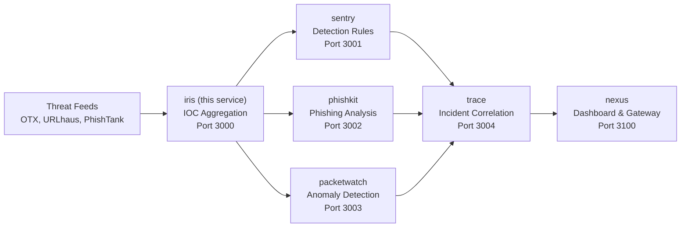

# Iris — Threat Intelligence Aggregation & IOC Platform

Aggregates threat intelligence from multiple open-source feeds (AlienVault OTX, URLhaus, PhishTank), deduplicates IOCs, scores confidence, generates alerts, and exposes everything via a REST API.

## Quick Start

```bash
git clone https://github.com/makhembu/iris
cd iris
cp .env.example .env
npm install
npm run build
npm start
# Server running at http://localhost:3000
```

## Architecture



iris ingests raw threat feeds, deduplicates and scores IOCs, then feeds downstream services for detection, analysis, and correlation.

## Docker

```bash
# Build and run standalone
docker build -t iris .
docker run -p 3000:3000 iris

# Run the full ecosystem
docker compose -f ../nexus/docker-compose.yml up
```

## Feed Ingestion

```bash
# Ingest from all enabled feeds
curl -X POST http://localhost:3000/feeds/ingest

# Or run offline
npm run feed:ingest
```

## API

### Health

```
GET /health
```

### Query IOCs

```
GET /iocs?type=ip&severity=critical&source=urlhaus&q=192.168&minConfidence=0.5&limit=50&offset=0
```

### Single IOC

```
GET /iocs/:id
```

### Statistics

```
GET /stats
```

Returns counts by type, severity, source, top confidence IOCs, feed status, and recent alerts.

### Feed status

```
GET /feeds
```

### Alerts

```
GET /alerts?acknowledged=false
POST /alerts/:id/acknowledge
```

## Demo

```bash
# Health check
curl http://localhost:3000/health

# List all IOCs
curl http://localhost:3000/iocs

# Stats dashboard
curl http://localhost:3000/stats

# Ingest feeds
curl -X POST http://localhost:3000/feeds/ingest
```

## Scoring

Confidence formula: `sourceTrust × 0.3 + crossSourceHits × 0.3 + typeWeight × 0.2 + ageFactor × 0.2`

| Source    | Trust |
|-----------|-------|
| abuse.ch  | 0.9   |
| Talos     | 0.85  |
| URLhaus   | 0.8   |
| PhishTank | 0.75  |
| AlienVault| 0.7   |
| Manual    | 1.0   |

## Feeds

- **AlienVault OTX** — IPs, domains, hashes, URLs
- **URLhaus** — Malware URLs
- **PhishTank** — Phishing URLs
- abuse.ch, Talos (planned)

## Why

Aggregating threat intel across feeds lets SOC analysts correlate sightings, reduce noise, and focus on high-confidence indicators. Built for the pipeline: iris IOCs feed sentry detection rules and trace incident timelines.

## Stack

- TypeScript
- Hono (lightweight API framework)
- better-sqlite3 (local persistence)
- Cloudflare Workers + D1 ready

## Roadmap

- [x] Multi-feed ingestion (OTX, URLhaus, PhishTank)
- [x] IOC deduplication with cross-source confidence scoring
- [x] REST API with query filtering and pagination
- [x] Alert generation for critical / cross-source IOCs
- [x] Feed status tracking and error reporting
- [ ] Scheduled feed ingestion (cron)
- [ ] STIX/TAXII export
- [ ] Enrichment pipeline (ASN lookup, WHOIS, GeoIP)
- [ ] Webhook alert forwarding

## Ecosystem

Part of a [threat intelligence ecosystem](ECOSYSTEM.md) that spans detection, analysis, anomaly detection, incident correlation, and a unified dashboard:

| Service | Port | Description |
|---------|------|-------------|
| **iris** | **3000** | **IOC aggregation** |
| [sentry](https://github.com/makhembu/sentry) | 3001 | Detection rules |
| [phishkit](https://github.com/makhembu/phishkit) | 3002 | Phishing analysis |
| [packetwatch](https://github.com/makhembu/packetwatch) | 3003 | Anomaly detection |
| [trace](https://github.com/makhembu/trace) | 3004 | Incident correlation |
| [nexus](https://github.com/makhembu/nexus) | 3100 | Dashboard & gateway |

Use `threat-stack.ps1` from the repo root to run all services: `.\threat-stack.ps1 start`
